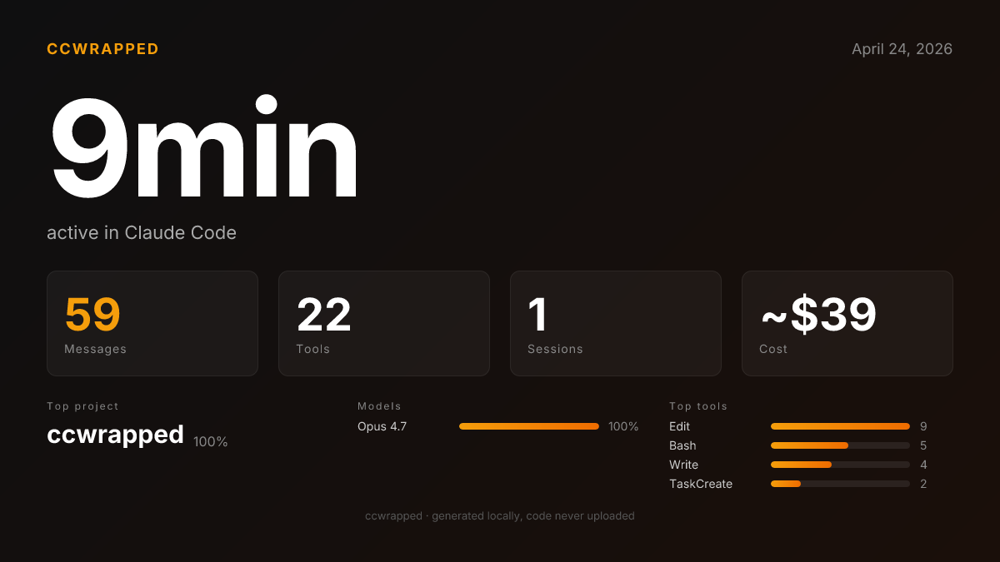
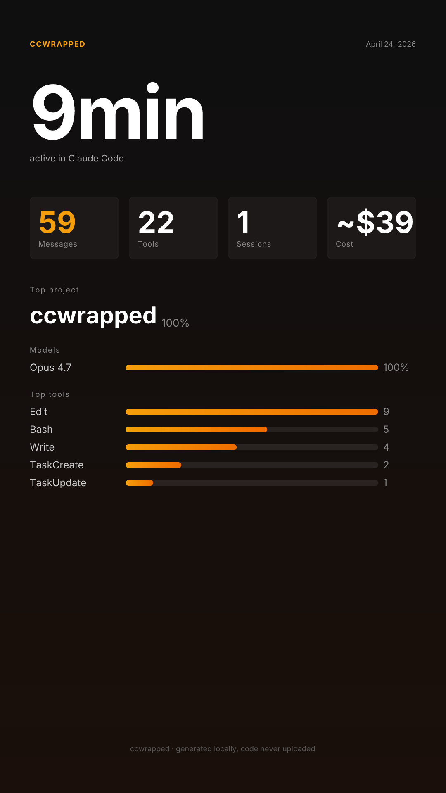

<div align="center">

# ccwrapped

**Your daily Claude Code report. Like Spotify Wrapped, for your AI coding habits.**

[English](README.md) · [中文](README.zh.md)

[](LICENSE)




</div>

---

Every night at 23:00 (or whatever time you pick), ccwrapped scans your local Claude Code conversation history, writes a short AI narrative about what you actually did that day, and drops a dark-themed HTML email in your inbox.

Wake up to a pretty card showing:

- How long you were actually active (minute-bucket de-dup, not naive start→end)
- Which projects you jumped between
- Which tools you used most (Bash? Edit? WebSearch?)
- Which files you edited repeatedly
- What it all costs in theoretical API equivalents
- A 2–3 sentence Story written by your own AI provider

**Everything runs locally.** Your code, messages, and file contents never leave your machine. Only aggregated numbers are sent to the AI provider (if you enable narrative) and to your own email (if you enable push).

---

## Why ccwrapped?

There are a dozen fantastic tools that dump raw Claude Code usage numbers in a terminal: [ccusage](https://github.com/ryoppippi/ccusage), [Claude-Code-Usage-Monitor](https://github.com/Maciek-roboblog/Claude-Code-Usage-Monitor), [claudelytics](https://github.com/nwiizo/claudelytics), [claude-usage](https://github.com/phuryn/claude-usage). They're great if you want a bank-statement view.

ccwrapped is different: it treats your Claude Code log like Spotify treats your listening history. It **tells a story**, generates a **share-ready PNG**, pushes to your **inbox**, and **runs itself every night**. You don't log in to a dashboard — you just open Gmail tomorrow morning.

|                       | ccusage | Usage Monitor | claude-usage | claudelytics | **ccwrapped** |
|-----------------------|:-------:|:-------------:|:------------:|:------------:|:-------------:|
| Token / cost stats    |    ✅    |       ✅       |      ✅       |      ✅       |      ✅       |
| Real-time TUI         |         |       ✅       |      ✅       |      ✅       |              |
| AI narrative          |         |               |              |              |    **✅**     |
| Shareable PNG         |         |               |              |              |    **✅**     |
| HTML email delivery   |         |               |              |              |    **✅**     |
| Scheduled auto-run    |         |               |              |              |    **✅**     |
| English + 中文         |         |               |              |              |    **✅**     |

---

## Screenshots

**Horizontal** (1200×675) — good for Twitter/X, blog posts:


**Vertical** (1080×1920) — good for Instagram Stories, TikTok, 小红书:



**HTML email** in your inbox, live-rendered by your mail client (colors adapt to light/dark mode).

---

## Install (60 seconds)

```bash
git clone https://github.com/PeiGuagua/ccwrapped.git
cd ccwrapped
npm install
npm run build
```

Test it without any config:

```bash
node dist/cli.js --no-ai
```

You should see today's stats in your terminal.

For convenience, link it as a global command:

```bash
npm link
# now anywhere:
ccwrapped
```

---

## Configure (3 minutes)

Create `~/.ccwrapped/config.json`. All sections are optional — you only need what you want.

```json
{
  "language": "en",
  "ai": {
    "base_url": "https://api.moonshot.cn/v1",
    "api_key": "sk-your-key",
    "model": "moonshot-v1-32k"
  },
  "email": {
    "resend_api_key": "re_your-key",
    "email_to": "you@example.com",
    "from": "onboarding@resend.dev"
  }
}
```

### Language

Set `"language": "en"` or `"language": "zh"`. If omitted, ccwrapped auto-detects from your OS locale (`LANG`). You can also override per-run via `--lang en` or `--lang zh`.

### AI provider options

Any OpenAI-compatible endpoint works:

| Provider | `base_url` | Suggested `model` |
|---|---|---|
| Moonshot (Kimi) | `https://api.moonshot.cn/v1` | `moonshot-v1-32k` |
| DeepSeek | `https://api.deepseek.com/v1` | `deepseek-chat` |
| OpenAI | `https://api.openai.com/v1` | `gpt-4o-mini` |
| OpenRouter | `https://openrouter.ai/api/v1` | any routed model |

Skip this block and the Story section uses a local template (no network call).

### Email

Sign up at [resend.com](https://resend.com), grab a free API key (3000 emails/month), and use it. On the free tier you can only send from `onboarding@resend.dev` to the email you signed up with — totally fine for self-emails. For a custom domain, verify it in Resend and use `from: "reports@yourdomain.com"`.

Skip this block and `--email` is a no-op.

---

## Commands

### One-shot

```bash
ccwrapped                    # today's report in terminal
ccwrapped --yesterday        # yesterday's
ccwrapped --date 2026-04-01  # any date
ccwrapped --no-ai            # skip AI call, use template
ccwrapped --share            # also save two PNGs to ~/Desktop
ccwrapped --email            # also send the HTML email
ccwrapped --lang zh          # Chinese output
ccwrapped --json             # raw stats as JSON
```

### Schedule (macOS only, for now)

```bash
ccwrapped install-cron              # daily at 23:00
ccwrapped install-cron --at 08:00   # or any HH:MM
ccwrapped trigger-cron              # run it now (test)
ccwrapped cron-status               # is it loaded?
ccwrapped uninstall-cron            # remove the schedule
tail -f ~/.ccwrapped/daily.log      # watch what launchd did
```

By default the scheduled job runs `ccwrapped --email`. If you want PNGs on Desktop too, edit `~/Library/LaunchAgents/com.ccwrapped.daily.plist` and add `--share` to `ProgramArguments`, then `uninstall-cron && install-cron`.

### Missed a day?

`launchd` tracks missed runs. If your Mac was asleep or off at 23:00, the job fires as soon as you wake the machine. If the Mac was off for multiple days, only the latest missed run is fired on wake (a feature, not a bug).

---

## How it works

```
~/.claude/projects/**/*.jsonl           (local, written by Claude Code)
        │
        │  stream-parse (no network)
        ▼
   per-day aggregation
        │
        ├─── terminal output   (default)
        ├─── HTML email        (--email  → Resend API)
        ├─── PNG × 2           (--share  → ~/Desktop)
        └─── AI narrative      (single request with aggregated numbers)
```

What leaves your machine, and when:

| Action | What's sent | Where |
|---|---|---|
| `ccwrapped` (default) | AI: aggregated numbers only | your configured AI provider |
| `ccwrapped --no-ai` | nothing | — |
| `ccwrapped --share` | nothing | PNGs saved to `~/Desktop` |
| `ccwrapped --email` | rendered HTML + narrative | Resend → your inbox |

Your actual file contents, code, conversation text, prompts, and command arguments are **never** transmitted.

---

## Privacy

- `~/.ccwrapped/config.json` stores API keys. Permissions can be tightened via `chmod 600 ~/.ccwrapped/config.json`.
- No telemetry. No analytics. No phone-home. Ever.
- Font files bundled in `templates/` are [Inter](https://rsms.me/inter/) (SIL Open Font License). Chinese CJK font (Noto Sans SC) is downloaded on first `--share` use if `language: "zh"` and cached to `~/.ccwrapped/fonts/`.

---

## Roadmap

- [ ] `npm publish` — one-liner `npx ccwrapped`
- [ ] Weekly & monthly wrap
- [ ] Year-in-review (auto-assemble on Dec 31)
- [ ] Windows (Task Scheduler) + Linux (systemd timer)
- [ ] Configurable PNG theme
- [ ] Embed PNG inline in email body
- [ ] Period comparisons (today vs yesterday, week-over-week)
- [ ] Optional "stuck detection" ("cli.ts is your top file 5 days in a row — want to pause?")

---

## Contributing

Issues and PRs welcome. If ccwrapped gave you a chuckle or a pretty screenshot, **please drop a ⭐** — it helps others find it.

Built on top of wonderful OSS:

- [satori](https://github.com/vercel/satori) — JSX to SVG
- [@resvg/resvg-js](https://github.com/yisibl/resvg-js) — SVG to PNG
- [resend](https://resend.com) — email delivery
- [commander](https://github.com/tj/commander.js) — CLI framework
- [kleur](https://github.com/lukeed/kleur) — terminal colors

---

## Author & contact

Built by **guagua** ([@PeiGuagua](https://github.com/PeiGuagua)), an indie developer working on overseas AI tools.

- **X / Twitter**: [@If1FVMlBbbqiCzF](https://x.com/If1FVMlBbbqiCzF)
- **WeChat**: `tuzi980116`
- Other projects: [ThumbAI](https://thumbai.app) · more coming

If ccwrapped is useful to you, a ⭐ on this repo means a lot.

---

## License

MIT © 2026 — [@PeiGuagua](https://github.com/PeiGuagua)
