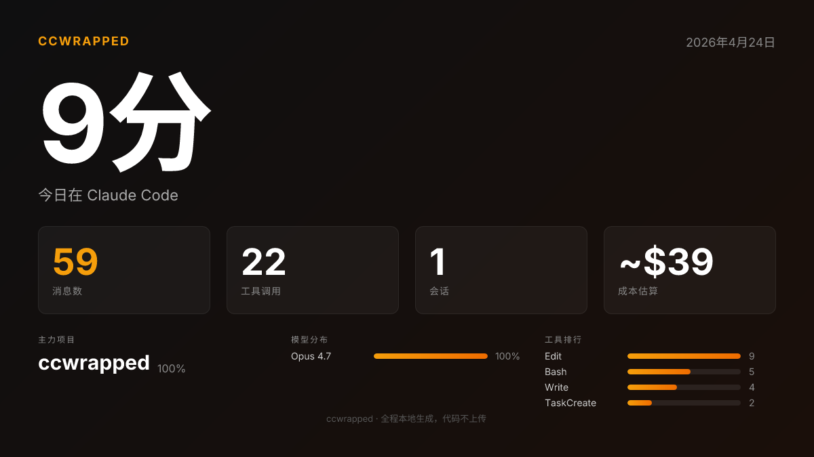
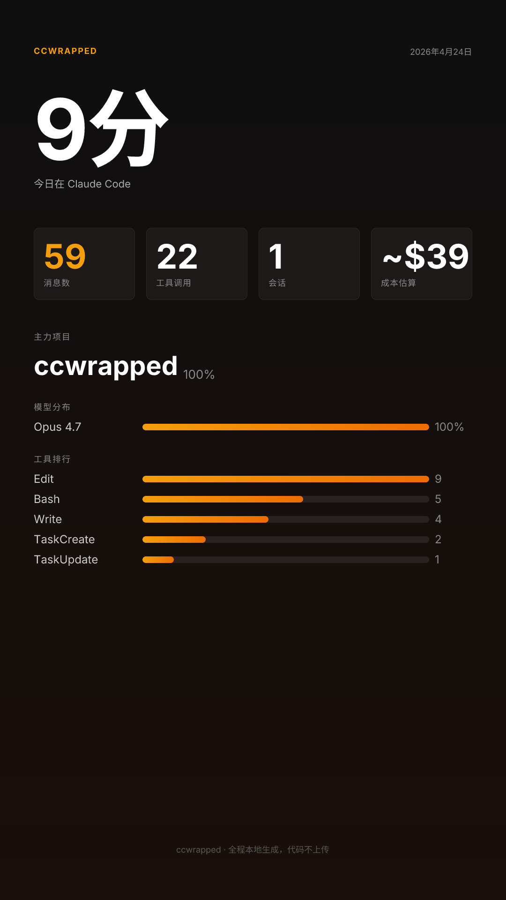

<div align="center">

# ccwrapped

**Claude Code 每日使用日报 · 像 Spotify Wrapped，但给写代码的人看。**

[English](README.md) · [中文](README.zh.md)

[](LICENSE)




</div>

---

每天晚上 23:00（或者你指定的任何时间），ccwrapped 会扫一遍你本地的 Claude Code 对话历史，用 AI 写一段简短的叙事，告诉你"今天在 AI 里都干了啥"，然后把一封深色主题的 HTML 邮件发到你邮箱。

第二天早上醒来，你会看到一张漂亮的卡片：

- **活跃时长**：用分钟桶去重算出来的真实活跃时间（不是简单的"首条-末条跨度"）
- **项目分布**：今天在哪些项目之间切换
- **工具排行**：Bash？Edit？WebSearch？哪个用得最多
- **高频文件**：哪些文件被反复编辑
- **成本估算**：按官方 API 价目折算的理论美金成本
- **今日叙事**：你配置的 AI 提供商写的 2-3 句话总结

**全部本地运行。** 你的代码、对话内容、文件内容**永远不会离开你的电脑**。只有聚合后的数字（纯统计）会发给 AI 提供商（如果你启用了叙事）和你自己的邮箱（如果你启用了邮件推送）。

---

## 为什么做 ccwrapped？

市面上已经有好几个优秀的 Claude Code 用量工具：[ccusage](https://github.com/ryoppippi/ccusage)、[Claude-Code-Usage-Monitor](https://github.com/Maciek-roboblog/Claude-Code-Usage-Monitor)、[claudelytics](https://github.com/nwiizo/claudelytics)、[claude-usage](https://github.com/phuryn/claude-usage)。它们都很好用，但它们给你的是"银行账单视图"——一堆冰冷的数字。

ccwrapped 不一样：它对待你的 Claude Code 日志的方式，像 Spotify 对待你的听歌记录。它**讲一个故事**，**生成可分享的图**，**推到你邮箱**，**每晚自动跑**。你不用登录任何 dashboard，打开 Gmail 看邮件就行。

|                       | ccusage | Usage Monitor | claude-usage | claudelytics | **ccwrapped** |
|-----------------------|:-------:|:-------------:|:------------:|:------------:|:-------------:|
| Token / 成本统计       |    ✅    |       ✅       |      ✅       |      ✅       |      ✅       |
| 实时终端界面           |         |       ✅       |      ✅       |      ✅       |              |
| AI 叙事                |         |               |              |              |    **✅**     |
| 可分享 PNG             |         |               |              |              |    **✅**     |
| HTML 邮件推送          |         |               |              |              |    **✅**     |
| 定时自动跑             |         |               |              |              |    **✅**     |
| 中英双语               |         |               |              |              |    **✅**     |

---

## 截图

**横版**（1200×675）——适合发推特 / X、博客头图：


**竖版**（1080×1920）——适合 Instagram Stories / TikTok / 小红书：



**HTML 邮件**：直接在邮件客户端实时渲染（颜色会自动跟随浅色/深色模式）。

---

## 安装（60 秒）

```bash
git clone https://github.com/PeiGuagua/ccwrapped.git
cd ccwrapped
npm install
npm run build
```

不配任何东西先跑一下看看：

```bash
node dist/cli.js --no-ai --lang zh
```

会在终端看到今天的中文日报。

想用全局命令，可以 link 一下：

```bash
npm link
# 之后在任何地方：
ccwrapped
```

---

## 配置（3 分钟）

创建 `~/.ccwrapped/config.json`：

```json
{
  "language": "zh",
  "ai": {
    "base_url": "https://api.moonshot.cn/v1",
    "api_key": "sk-你的Kimi-key",
    "model": "moonshot-v1-32k"
  },
  "email": {
    "resend_api_key": "re_你的Resend-key",
    "email_to": "you@example.com",
    "from": "onboarding@resend.dev"
  }
}
```

三个字段都是可选的，只填你需要的部分。

### 语言

填 `"language": "zh"` 或 `"language": "en"`。不填的话，ccwrapped 会根据你系统的 `LANG` 环境变量自动选。也可以用 `--lang zh` / `--lang en` 在运行时临时切换。

### AI 提供商

任何 OpenAI 兼容接口都能用：

| 提供商 | `base_url` | 推荐 `model` |
|---|---|---|
| Moonshot (Kimi) | `https://api.moonshot.cn/v1` | `moonshot-v1-32k` |
| DeepSeek | `https://api.deepseek.com/v1` | `deepseek-chat` |
| OpenAI | `https://api.openai.com/v1` | `gpt-4o-mini` |
| OpenRouter | `https://openrouter.ai/api/v1` | 任意支持的模型 |

不填这个 block 的话，Story 部分会走本地模板（零网络）。

### 邮件

去 [resend.com](https://resend.com) 免费注册，拿一个 API key（免费额度 3000 封/月）。免费版只能用 `onboarding@resend.dev` 这个地址发件，且只能发给你注册 Resend 用的那个邮箱——对"自己发给自己"完全够用。想用自己域名发件，要在 Resend 里 verify 域名，然后把 `from` 改成 `reports@yourdomain.com`。

不填这个 block，`--email` 就是 no-op。

---

## 常用命令

### 一次性运行

```bash
ccwrapped                    # 今日日报（终端）
ccwrapped --yesterday        # 昨日
ccwrapped --date 2026-04-01  # 任意一天
ccwrapped --no-ai            # 跳过 AI，用本地模板
ccwrapped --share            # 同时存两张 PNG 到 ~/Desktop
ccwrapped --email            # 同时发 HTML 邮件
ccwrapped --lang en          # 用英文输出
ccwrapped --json             # 输出原始 JSON 统计
```

### 定时任务（目前只支持 macOS）

```bash
ccwrapped install-cron              # 每晚 23:00
ccwrapped install-cron --at 08:00   # 或者任何 HH:MM
ccwrapped trigger-cron              # 立即触发一次（测试用）
ccwrapped cron-status               # 查看是否加载
ccwrapped uninstall-cron            # 卸载
tail -f ~/.ccwrapped/daily.log      # 看 launchd 的运行日志
```

默认定时任务跑 `ccwrapped --email`。如果你还想让它每晚顺便在桌面存 PNG，可以编辑 `~/Library/LaunchAgents/com.ccwrapped.daily.plist`，在 `ProgramArguments` 里加 `--share`，然后 `uninstall-cron && install-cron`。

### 错过时间会怎样？

`launchd` 会记录"错过的任务"。如果 Mac 在 23:00 正在休眠或者关机，等你醒来的第一时间会自动补跑。如果 Mac 连续关了几天，只会补跑最近一次（这是 launchd 的默认行为，不是 bug）。

---

## 工作原理

```
~/.claude/projects/**/*.jsonl        （本地，Claude Code 自己写的）
        │
        │  流式解析（不联网）
        ▼
   按天聚合统计
        │
        ├─── 终端输出        （默认）
        ├─── HTML 邮件       （--email  → Resend API）
        ├─── PNG × 2         （--share  → ~/Desktop）
        └─── AI 叙事         （一次请求，只发聚合数字）
```

什么数据会离开你的电脑、何时离开：

| 操作 | 发送内容 | 目的地 |
|---|---|---|
| `ccwrapped`（默认） | 聚合数字（无代码、无原文） | 你配置的 AI 提供商 |
| `ccwrapped --no-ai` | 无 | — |
| `ccwrapped --share` | 无 | PNG 存到 `~/Desktop` |
| `ccwrapped --email` | 渲染后的 HTML + 叙事 | Resend → 你的邮箱 |

**文件内容、代码、对话原文、prompt、命令参数——永远不会发出去**。

---

## 隐私

- `~/.ccwrapped/config.json` 保存 API key。建议 `chmod 600 ~/.ccwrapped/config.json` 锁权限。
- 零 telemetry、零 analytics、永不 phone-home。
- 打包在 `templates/` 里的字体是 [Inter](https://rsms.me/inter/)（SIL Open Font License）。中文 CJK 字体（Noto Sans SC）只在你第一次用 `--share` + `language: "zh"` 时下载一次，缓存在 `~/.ccwrapped/fonts/`。

---

## 路线图

- [ ] `npm publish` —— 支持 `npx ccwrapped` 一行安装
- [ ] 周报 / 月报
- [ ] 年度总结（每年 12/31 自动生成）
- [ ] Windows（Task Scheduler）+ Linux（systemd timer）支持
- [ ] PNG 主题可配置
- [ ] 邮件里内嵌 PNG（而非 HTML）
- [ ] 时段对比（今日 vs 昨日、本周 vs 上周）
- [ ] "卡壳检测"（cli.ts 连续 5 天都在 top —— 要不要歇一下？）

---

## 欢迎贡献

有 issue 或者 PR 欢迎提。如果 ccwrapped 让你笑了一下、或者截图让你觉得好看，**点个 ⭐ 就是最大的支持**——可以帮更多同类用户发现这个工具。

基于这些优秀的开源项目：

- [satori](https://github.com/vercel/satori) —— JSX → SVG 渲染引擎
- [@resvg/resvg-js](https://github.com/yisibl/resvg-js) —— SVG → PNG 转换
- [resend](https://resend.com) —— 邮件发送服务
- [commander](https://github.com/tj/commander.js) —— CLI 框架
- [kleur](https://github.com/lukeed/kleur) —— 终端着色

---

## 作者 & 联系方式

**guagua**（[@PeiGuagua](https://github.com/PeiGuagua)），独立开发者，做海外 AI 工具。

- **X / Twitter**：[@If1FVMlBbbqiCzF](https://x.com/If1FVMlBbbqiCzF)
- **微信**：`tuzi980116`
- 其他项目：[ThumbAI](https://thumbai.app) · 更多正在路上

如果 ccwrapped 对你有用，给 repo 点个 ⭐ 对我意义重大。

---

## License

MIT © 2026 — [@PeiGuagua](https://github.com/PeiGuagua)
